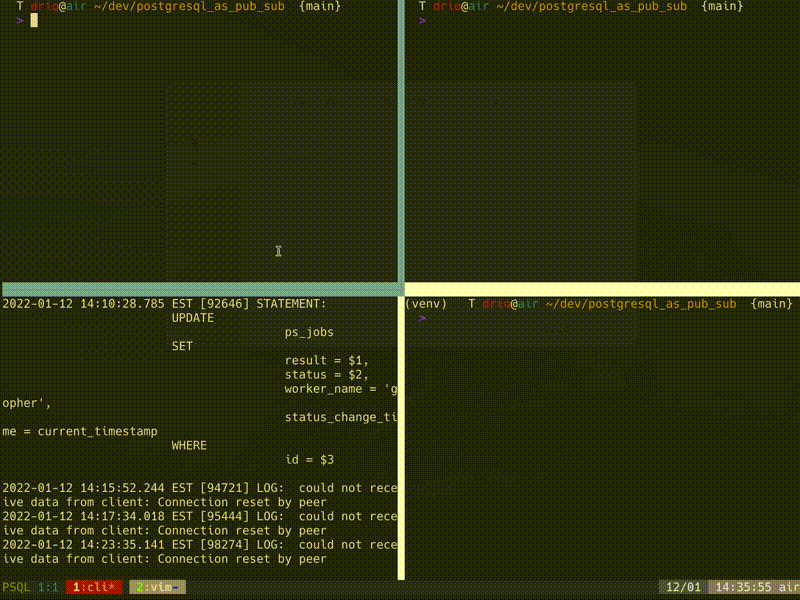

## Intro

This is a proof of concept to explore the idea of using [PostgreSQL as a job server](https://webapp.io/blog/postgres-is-the-answer/).



## Usage

1. Start your psql instance: `$ make start-fg` (console 1)
2. Create the database and tables: `$ make clean up-sql`
3. Create jobs: `$ make jobs` (console 2)
4. Connect to the db with the psql client: `make` (console 3) and tell psql you 
   want to listen to the channel that omits events on table changes with: `listen jobs_status_channel;`.
   This is just for you to make sure you are getting data in the channel.
6. In more consoles, run your workers:
    ```
    $ source venv/bin/activate
    $ python ./worker.py
    ```
    or, if you are a gopher:
    ```
    $ go run ./worker.go
    ```

### Home brew installation output

```txt
==> postgresql
To migrate existing data from a previous major version of PostgreSQL run:
  brew postgresql-upgrade-database

This formula has created a default database cluster with:
  initdb --locale=C -E UTF-8 /opt/homebrew/var/postgres
For more details, read:
  https://www.postgresql.org/docs/14/app-initdb.html

To restart postgresql after an upgrade:
  brew services restart postgresql
Or, if you don't want/need a background service you can just run:
  /opt/homebrew/opt/postgresql/bin/postgres -D /opt/homebrew/var/postgres
```

## References

1. [Psql as job server](https://webapp.io/blog/postgres-is-the-answer/)
2. [HN discussion](https://news.ycombinator.com/item?id=29599132)
3. [Psql cheatsheet](https://gist.github.com/xpepper/8110743)
